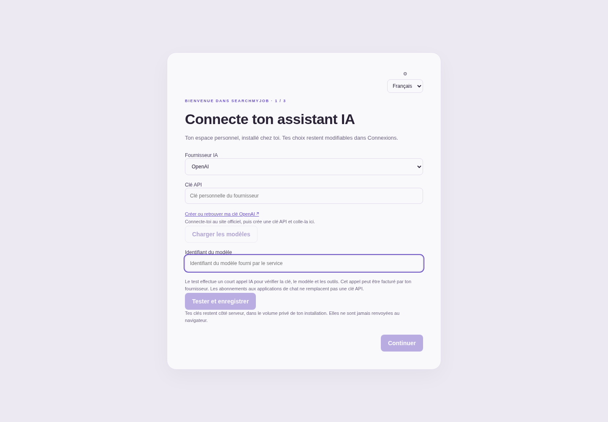

# SearchMyJob · édition Docker

**Version 0.3.8 · Installation personnelle · Français / English**



Un espace personnel pour chercher un emploi ou des missions, organiser ses pistes,
travailler son profil et préparer ses candidatures. Réalisé par **Mr.yums**.
Cette édition autonome permet d’installer et d’examiner le projet chez soi.
Elle démarre vide : aucun compte, aucune clé et aucune conversation de son auteur.

## Français / English

L’interface et son guide sont disponibles en **français et anglais**. Le sélecteur est
accessible dès la première ouverture et dans l’en-tête de l’espace. Le choix est
mémorisé dans le navigateur ; aucun rechargement ni effacement de brouillon. Les
contenus personnels (CV, conversations, annonces, documents) ne sont pas traduits
automatiquement. Les dates et nombres suivent la langue choisie.

English installation guide: [docs/README.en.md](docs/README.en.md).

## Installer

Prérequis : Docker Engine avec Docker Compose v2, ou Docker Desktop.
Télécharger le ZIP depuis les [versions publiées](https://github.com/Mr-yums/SearchMyJob/releases),
l’extraire et ouvrir un terminal dans le dossier `searchmyjob-docker`, puis :

```sh
docker compose up -d --build
```

Ouvrir **http://127.0.0.1:8936**. La première construction télécharge les dépendances.
L’interface est accessible uniquement depuis l’ordinateur sur lequel Docker tourne.
Le déploiement sur un serveur public avec comptes multiples n’est pas prévu par cette édition.

## Première ouverture

1. Choisir **DeepSeek, Kimi, Claude ou OpenAI**.
2. Saisir une clé API personnelle, charger les modèles proposés par le fournisseur,
   puis sélectionner un modèle conversationnel. Un identifiant exact peut aussi être saisi.
3. Cliquer **Tester et enregistrer**. Un court appel vérifie que le modèle répond et
   prend en charge les appels d’outils. La configuration n’est enregistrée qu’après succès.
   Ce test peut être facturé par le fournisseur. Une ancienne configuration valide est
   conservée si le nouveau test échoue.
4. Configurer séparément **France Travail** (Client ID + secret de l’API Offres d’emploi)
   et/ou **Bright Data** (accès MCP et collecteurs selon les plateformes choisies).
   La source choisie doit être configurée avant l’activation ; France Travail couvre
   uniquement la France. Enregistrer une clé ne déclenche aucune recherche ;
   tester une collecte Bright Data peut être facturé.
5. Décrire son activité et activer son espace. La veille est désactivée initialement.

Un abonnement à une application de chat n’est pas utilisé par ce paquet : les appels
passent par les API personnelles. Aucun client Codex, Claude Code ou Kimi Code n’est requis.
Les catalogues changent : le test du modèle choisi est la validation déterminante.
Les modèles image, audio et embeddings ne sont pas proposés. Tous les modèles affichés
par une plateforme ne prennent pas nécessairement en charge les outils requis.

## Utiliser

- **Conversation** : discuter de son projet, rechercher des pistes et consulter les sources.
- **Mon profil** : saisir ses compétences ou importer un CV texte/PDF/DOCX.
- **Opportunités** : conserver les offres, retrouver leur provenance et préparer CV/lettres.
- **Documents / Courrier** : relire les brouillons ; l’IA ne dispose d’aucun outil d’envoi.
- **Veille** : définir les critères, la source et le rythme, puis activer explicitement.
- **Connexions** : modifier les fournisseurs et consulter les tokens et le compteur Bright Data.

Le chat et la veille ont chacun un sélecteur IA ; le fournisseur choisi doit être configuré.
La source des offres (France Travail, Bright Data ou les deux) se règle dans la veille.
Une recherche web générale nécessite Bright Data ; une clé IA seule n’active pas un moteur de recherche.
La lecture directe d’une URL publique et la consultation des fiches locales restent possibles.

## Données et coûts

Le volume Docker `searchmyjob-community_data` contient les conversations, profils, documents,
compteurs et clés. Aucun répertoire de l’ordinateur hôte n’est monté dans l’application.
Les clés sont conservées dans `credentials.sqlite3`, avec permissions `0600`, côté serveur.
Le fichier n’est **pas chiffré** : administrer et sauvegarder ce volume comme des données privées.
Les clés ne sont pas renvoyées dans les réponses HTTP ni conservées dans le stockage du navigateur.
Les brouillons du chat peuvent être conservés dans le navigateur local.

Les échanges IA transmettent au fournisseur choisi le contexte utile (profil, messages,
offres, extraits). Les recherches transmettent les critères aux sources configurées.
« Installé chez soi » ne signifie donc pas « IA hors ligne ».

Le compteur Bright Data démarre à zéro, avec une limite locale de 200 appels. Il bloque
les nouvelles opérations comptées lorsqu’elle est atteinte. Ce n’est ni une limite en euros,
ni une garantie de gratuité, ni le solde de tous les usages du compte Bright Data.
Les outils IA sont bornés à 24 appels, dont 6 opérations externes, par passage ; un échange
complet est limité à 12 réponses du modèle et 240 secondes. Pas de relance HTTP automatique.

## Arrêter, relancer, mettre à jour

Dans le dossier du projet :

```sh
docker compose stop
docker compose up -d
docker compose logs --tail=80 app
docker compose up -d --build
```

`docker compose down` retire les conteneurs et garde les données. Ne pas ajouter `-v`
pour une simple mise à jour : cela effacerait le volume.
Pour changer les ports, copier `.env.example` vers `.env` et ajuster les deux nombres
avant de relancer. Le port OAuth Gmail doit rester identique à l’intérieur et à l’extérieur.

Sauvegarde du volume, application arrêtée :

```sh
docker compose stop
docker compose run --rm --no-deps -T app python -c "import tarfile,sys; t=tarfile.open(fileobj=sys.stdout.buffer,mode='w|gz'); t.add('/state',arcname='state'); t.close()" > searchmyjob-private-backup.tar.gz
docker compose up -d
```

Cette archive contient les clés : ne jamais l’inclure dans le paquet public.
Voir [docs/EXPLOITATION.md](docs/EXPLOITATION.md) pour la restauration et Gmail.

## Organisation et validation

- `backend/` : serveur FastAPI, API IA, sources, stockage et outils.
- `ui/` : interface Vue ; seules ses ressources compilées sont servies.
- `mcp/` : connecteurs Bright Data et garde des appels.
- `tests/` : régressions et simulations des API, sans clés réelles.
- `docs/` : exploitation, architecture et références des API.
- `scripts/` : création du paquet distribuable par liste de fichiers autorisés.

```sh
python -m venv .venv
.venv/bin/pip install -r requirements-dev.txt
npm ci --prefix ui
npm run build --prefix ui
npm ci --prefix mcp
.venv/bin/python -m pytest -q
```

Pour les tests hors Docker : Python 3.14 et Node 24 ou supérieur, notamment pour `node:sqlite`.
Les tests utilisent des données temporaires et des API simulées. Les appels facturés aux
quatre fournisseurs, la collecte réelle et Gmail ne sont pas validés sans comptes personnels.

## À propos

Ce projet illustre mon travail sur les interfaces, les API, les agents IA et les applications
installables. Conception et pilotage par **Mr.yums**, développement assisté par IA.
Pour découvrir mes autres réalisations ou retrouver mon profil :
[Mr.yums sur GitHub](https://github.com/Mr-yums).

## Organisation du code

Voir [Architecture](docs/architecture.md). Le backend est un paquet `backend/searchmyjob`, les vues sont regroupées par fonctionnalité et les tests par niveau. La fabrique HTTP est `searchmyjob.api.app:create_app`.

## Recherche internationale · 0.3.0

Le parcours demande le **pays**, le **métier**, les **plateformes** (LinkedIn, Indeed,
autres sites), les préférences de travail et la langue de l’aide. La clé **Bright Data**
est demandée séparément de la clé IA ; France Travail est proposé pour la France.
LinkedIn et Indeed passent par leurs collecteurs d’annonces publiques Bright Data.
Les réglages restent modifiables dans Opportunités. Voir [Sources et limites](docs/search-sources.md)
pour les accès requis, les coûts, la couverture et les vérifications effectuées.

Choose your **country**, **profession**, **platforms**, work preferences and advice
language during setup. Your **Bright Data** key is separate from your AI key.
LinkedIn/Indeed use public job scrapers. See [Search sources](docs/search-sources.md)
for account requirements, costs and verification limits.

## Liens officiels pour les clés API / Official API key links

- [DeepSeek](https://platform.deepseek.com/api_keys)
- [Kimi](https://platform.kimi.ai/console/api-keys)
- [Claude](https://platform.claude.com/settings/keys)
- [OpenAI](https://platform.openai.com/api-keys)
- [Bright Data](https://brightdata.com/cp/setting/users)
- [France Travail IO](https://francetravail.io/)

## Version publique et limites

Cette édition utilise les clés API de son installateur. Elle est distincte de mon
espace personnel : les évolutions de celui-ci ne sont pas automatiquement incluses.
Les tests automatisés simulent les services externes ; les appels IA payants, les
collecteurs LinkedIn/Indeed et Gmail restent à vérifier avec les comptes de l’installateur.
La disponibilité du code ne constitue pas une licence open source ; aucune licence
de réutilisation générale n’est accordée dans cette version.

Historique : [notes de version](docs/CHANGELOG.md).
